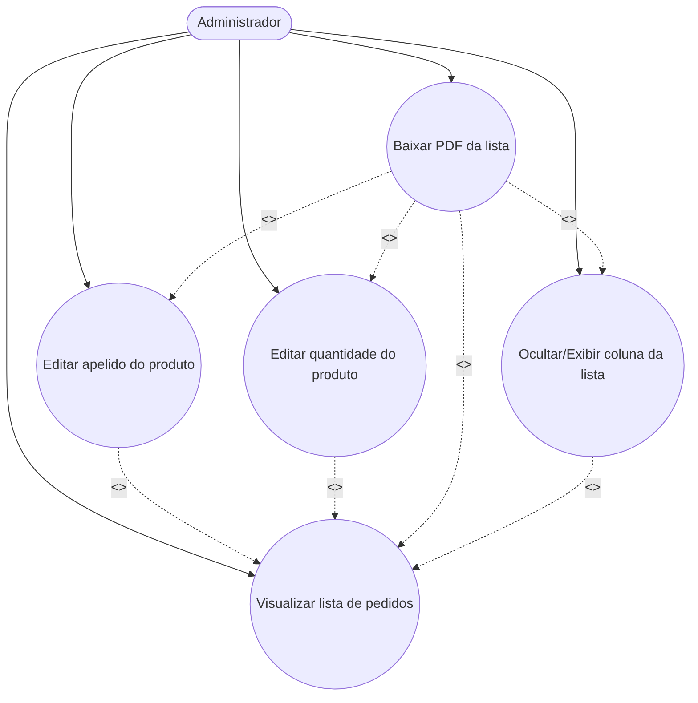
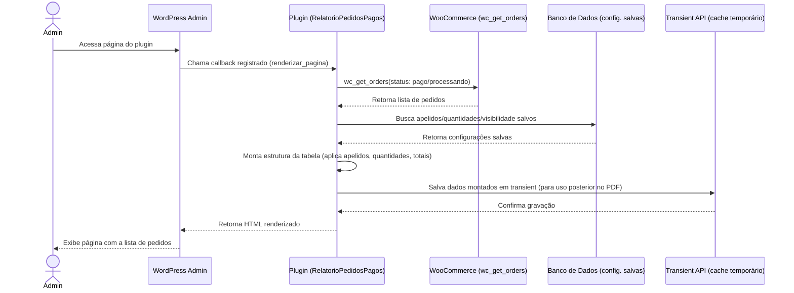
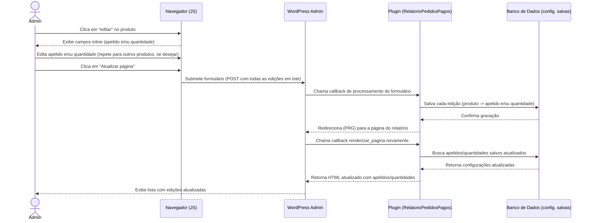
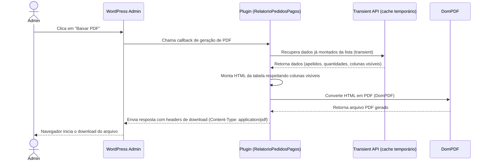

# Relatório Personalizado de Pedidos Pagos WooCommerce — Plugin WordPress/WooCommerce

Plugin administrativo para WooCommerce que gera uma lista personalizada de pedidos pagos, com edição de nomes e quantidades personalizadas de produtos, com exportação em PDF.

## Motivação

Em lojas WooCommerce com nomenclatura técnica de produtos (SKUs, variações, nomes longos), o relatório operacional do dia a dia (ex: separação/expedição de pedidos) fica mais difícil de ler do que precisaria. Este plugin permite:

- Consolidar rapidamente quais produtos saíram, em qual quantidade, por pedido — sem precisar abrir cada pedido individualmente no admin padrão do WooCommerce.
- Usar apelidos internos para os produtos (em vez do nome de cadastro), facilitando a leitura por quem opera o processo físico (separação, embalagem, etc).
- Ajustar manualmente a quantidade exibida e somada quando houver divergência entre o pedido registrado e o que efetivamente será processado, somando por exemplo kits com 3, 6, etc.
- Exportar essa lista em PDF para uso offline (impressão, conferência manual).

## Funcionalidades planejadas

1. Ícone e página personalizada na barra lateral do admin do WordPress.
2. Lista de pedidos com status pago/processando, com botão de exportação em PDF — o PDF reflete os apelidos, quantidades e colunas visíveis configurados na tela, não os dados originais do sistema.
3. Colunas: número do pedido, nome do cliente no endereço de entrega, produtos vendidos (com quantidade individual), frete e total do pedido — com totalizadores ao final de cada coluna numérica e opção de ocultar/exibir colunas.
4. Edição de apelido por produto (persistente — reutilizado sempre que o produto aparecer novamente na lista).
5. Edição de quantidade por produto (persistente — reutilizado sempre que o produto aparecer novamente na lista) diretamente na lista.

## Diagrama de Caso de Uso

## Diagrama de Sequência — Visualizar lista de pedidos

## Diagrama de Sequência — Editar apelido e/ou quantidade do produto

## Diagrama de Sequência — Baixar PDF da lista

## Status do projeto

🚧 Em desenvolvimento — fase de modelagem (diagramas de caso de uso, sequência e classe).

## Stack

- WordPress + WooCommerce
- PHP 8.1+ (recomendado 8.3+, conforme padrão atual da WooCommerce)